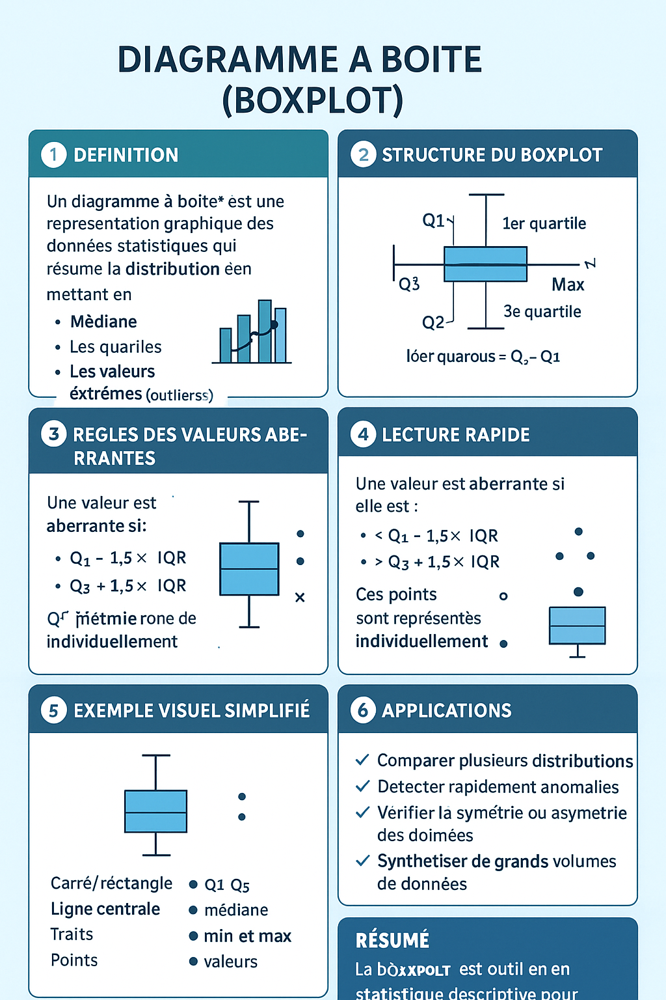

# **Le diagramme à boîte**
La boîte à moustache (ou diagramme en boîte) est un outil graphique utilisé en statistique pour résumer et visualiser une série de données numériques de manière rapide et synthétique.
## **À quoi sert la boîte à moustache ?**
* Visualiser la distribution : Elle permet d'afficher la répartition des valeurs d'un ensemble de données, notamment la médiane, les quartiles, ainsi que les valeurs extrêmes.
* Repérer la dispersion : D’un coup d’œil, on peut observer la dispersion des données (variation autour de la médiane) grâce à l’écart entre les quartiles et à la longueur des moustaches.
* Détecter les valeurs aberrantes : Les points situés au-delà des moustaches sont identifiés comme des valeurs atypiques ou aberrantes, facilitant leur repérage.
* Comparer des groupes : On peut comparer la distribution d’une variable dans plusieurs groupes distincts, par exemple l’âge entre différents groupes d’individus.
* Synthèse visuelle : Elle offre un résumé visuel du minimum, du premier quartile (Q1), de la médiane (Q2), du troisième quartile (Q3) et du maximum ou des valeurs extrêmes.

## **Comment fonctionne la boîte à moustache ?**
* La boîte va du 1er quartile (Q1) au 3e quartile (Q3), contenant 50% des données.
* La ligne à l’intérieur de la boîte indique la médiane (Q2), soit le centre des données.
* Les moustaches s’étendent des extrémités de la boîte jusqu’aux valeurs qui sont à 1,5 fois l’écart interquartile (IQR : Q3-Q1) ou jusqu’aux valeurs minimales et maximales si elles sont dans cette plage.
* Points isolés au-delà des moustaches signalent des valeurs aberrantes.

Parfois, la moyenne est représentée par un autre symbole (souvent une croix).

## Exemple d’utilisation
* Dans le cadre d’un projet de data science, une boîte à moustache pourrait être utile pour :
* Diagnostiquer la présence d’outliers avant un apprentissage automatique.
* Visualiser la distribution d’une variable quantitative (salaire, age, score, etc.).
* Comparer la dispersion de différentes populations ou groupes.

La boîte à moustache est donc un outil fondamental en statistiques exploratoires, facilitant la compréhension et l’analyse des données de façon intuitive pour un data scientist ou un analyste.
