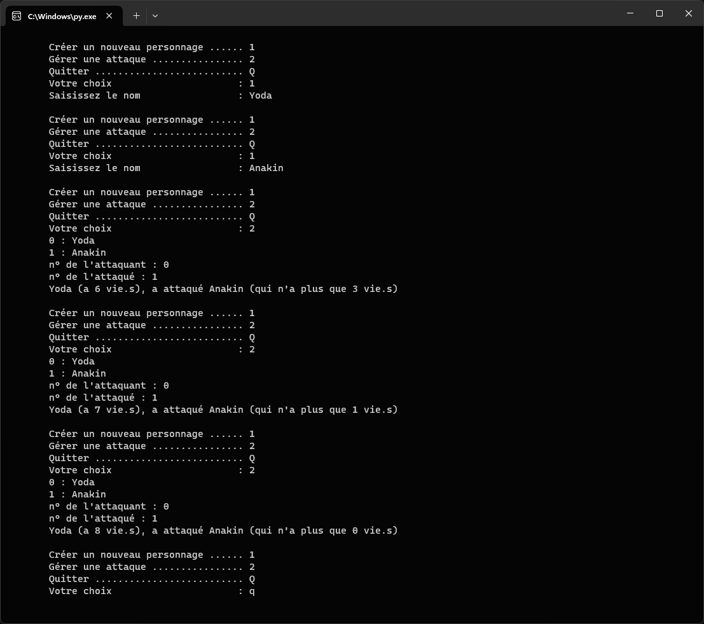

# **Gestion de personnages** 

L'utilisateur peux :
* Créer un personnage ;
* Gérer les attaques ;
* Quitter.

Chauqe personnages à 5 vies.  
L'attaquant en gagne 1.  
L'attaqué en perd 2.  
Il est impossibe d'avoir moins de 0 vie.

