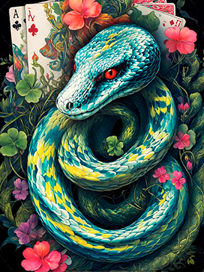

# **Python** 

[Les dictionnaires](../exercises/practice10)  
[Les sets](../exercises/practice11)  
[Les fonctions](../exercises/practice12)  
[Les compréhensions](../exercises/practice15)  
[Les fonctions de première classe et expressions lambda](../exercises/practice16)  
[Les importations](../exercises/practice18)  
[La gestion des exceptions](../exercises/practice19)  
[Diviser le code dans plusieurs fichiers](../exercises/practice21)  
[Les itérateurs](../exercises/practice22)  

> ## **Le framework** 

[Qu'est que Qt ?](qt "Qu'est que le framework Qt")  
[Les bindings](qt/bindings "Les bindings")  
[L'anatomie d'une application](qt/anatomyOfAnApp "L'anatomie d'une application Qt")

> ## **Le framework** 

[Qu'est-ce que c'est ?](django "Qu'est-ce que Django ?")  
[Le langage DTL](django/dtl/ "Le langage de gabarits de Django")  
[Liste des balises DTL](django/dtl/balises "La liste des balises DTL")  
<!-- [L'ORM](orm "Object-Relational Mapping") <kbd>**Wip**</kbd>   -->

