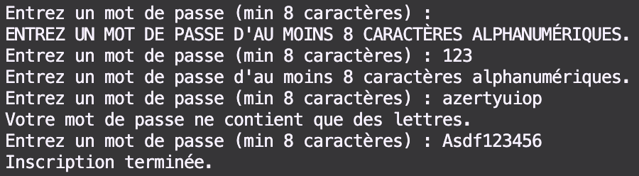

# **Projet de Validation de Mot de Passe**
## **Description**
C'est un simple script qui demande un mot de passe et vérifie sa validité.  
Le mot de passe doit respecter les critères de sécurité avant de terminer son inscription.
## **Fonctionnalités**
- Le mot de pase doit être d'au-moins 8 caractère ;
- Ne pas contenir que des chiffres ;
- Boucle tant que le mot de passe est invalide.
## **Conditions de Validation**
1. **La longueur du Mot de Passe :**
   - Si elle est égale à 0, afficher un message en majuscules indiquant que le mot de passe est trop court ;
   - Si elle est inférieure à 8 caractères, afficher un message avec une majuscule au début indiquant que le mot de passe est trop court.

2. **Contenu du Mot de Passe :**
   - Si le mot de passe ne contient que des chiffres, afficher un message indiquant que le mot de passe ne contient que des chiffres.

3. **Mot de Passe Valide :**
   - S'il a au moins 8 caractères et ne contient pas uniquement des chiffres ou lettres, afficher un message confirmant que l'inscription est terminée.

