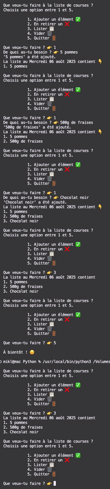

# **Liste de courses teès simple et sans interface"**<a href="../../../"></a>
Ce script Python permet de gérer une liste de courses de manière interactive. Vous pouvez ajouter, retirer, lister et vider les éléments de votre liste de courses.

## **Fonctionnalités**
- **Ajouter un élément** ✅ : Ajoute un article à votre liste de courses.
- **Retirer un élément** ❌ : Retire un article de votre liste de courses en spécifiant son indice.
- **Lister les éléments** 📋 : Affiche tous les articles actuellement dans votre liste de courses.
- **Vider la liste** 🗑️ : Supprime tous les articles de votre liste de courses.
- **Quitter** 🚪 : Sauvegarde et ferme l'application.

## **Prérequis**
- Python 3.x
- Les modules `datetime`, `locale` pour la gestion des dates en français, `os` et `json`


## **L'utiliser**
1. Exécutez le script avec Python :
```py
python nom_du_script.py
```
2. Les intructions
```
Que veux-tu faire à la liste de courses ?  
Choisi une option entre 1 et 5.  

           1. Ajouter un élément  ✅
           2. En retirer un       ❌ 
           3. Lister              📋 
           4. Vider               🗑️ 
           5. Quitter             🚪

Que veux-tu faire ? 👉  
```
