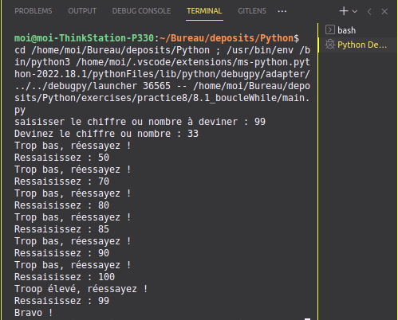

# Devinette <a href="../../../"></a>

* Écrire un programme de devinette avec un boucle while.
* Le but est de deviner un chiffre ou nombre de 1 à 100.
* Dire si c'est au dessus ou en dessous
* La boucle s'arrête dés que le chiffre ou nombre et trouvé.  

```python  
# définition du nombre à deviner
target_number = int(input("saisisser le chiffre ou nombre à deviner : "))
# devinette
guess = int(input("Devinez le chiffre ou nombre : "))
# boucler tant que l'éléemnt n'est aps trouvé
while guess != target_number:
    if guess > target_number:
        print("Troop élevé, réessayez !")
    else:
        print("Trop bas, réessayez !")
    guess = int(input("Ressaisissez : "))
print("Bravo !")
```
Aperçu  
