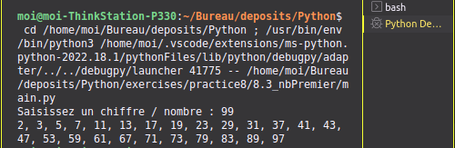

# **Nombre premier** <a href="../"></a>

#### Consigne

- Imprimer les nombres premiers entre 1 et 100.

#### Code

```python
dividend = int(input('Saisissez un chiffre / nombre : '))

primes = []
for dividend in range(2, 101):
    for divisor in range(2, dividend):
        if dividend % divisor == 0:
            break
    else:
        primes.append(str(dividend))
print(", ".join(primes))
```

#### Aperçu


