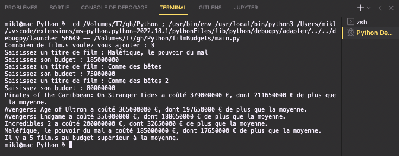

Consigne : 
* Calcul du budget moyen des films
* Imprimer la quantité de film supérieur au budget moyen
* Imprimr les films au budget supérieur à la moyenne calculée
- *Ce qui suit est subsidiaire*
    * Permettre l'ajout de film.s
        * Demander combien
        * Demandr le titre

```python
# liste
movies = [
    ("Eternal Sunshine of the Spotless Mind", 20000000),
    ("Memento", 9000000),
    ("Requiem for a Dream", 4500000),
    ("Pirates of the Caribbean: On Stranger Tides", 379000000),
    ("Avengers: Age of Ultron", 365000000),
    ("Avengers: Endgame", 356000000),
    ("Incredibles 2", 200000000)
]
# nouveau films
new_movie_count = int(input("Comnbien de film.s voulez vous ajouter : "))
for _ in range(new_movie_count):
    name = input("Saisissez un titre de film : ")
    budget = int(input("Saisissez son budget : "))
    movie_added = (name, budget)
    movies.append(movie_added)
# variables
high_budget_movies = []
total_budget = 0
# budget moyen
for movie in movies:
    total_budget = total_budget + movie[1]
average_budget = int(total_budget / len(movies))
# lequel dépasse le budget moyen
for movie in movies:
    if movie[1] > average_budget:
        high_budget_movies.append(movie)
        over_average_cost = movie[1] - average_budget
        print(f"{movie[0]} a coûté {movie[1]} €, dont {over_average_cost} € de plus que la moyenne.")
print(f"Il y a {len(high_budget_movies)} film.s au budget supérieur à la moyenne.")
```
