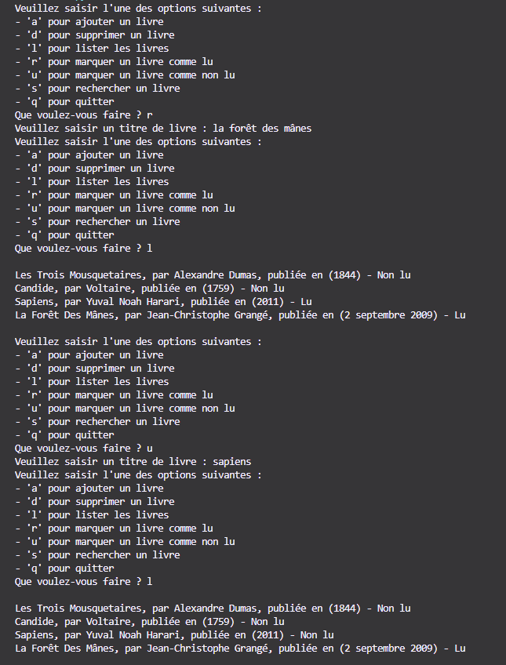

# **Liste des livres en JSON**

Le programme doit permettre : 
* d'ajouter un livre ;
* de le supprimer ;
* d'afficher la liste ;
* de marquer comme lu ;
* de rechercher ;
* de quitter.

La lsite est dans un fichier JSON.

