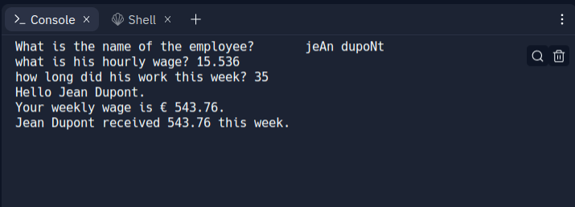

# Calculateur de salaire hebdomadaire 


***Ce programme fonctionne en ligne de commande***
```
Pour fonnctionner, il à besoin :
- du Nom de la personne ;
- du taux horaire ;
- du nombre d'heure travaillé.

Une capture vous donne un aperçu.
```

