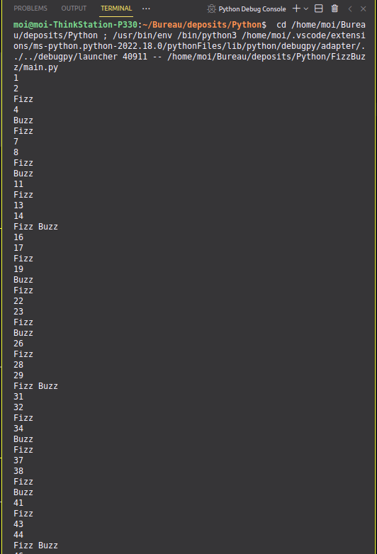

# Projet Fizz Buzz 


Chaque jouur commance par dire le chiffre 1.  
* Si le chiffre ou nombre est divisible par 3 dire, **"Fizz"** ;
* s'il est divisible par 5, dire **"Buzz"** ;  
* S'il est divisible par les deux (soit par quinze), dire **"Fizz Buzz"** ;
* Sinon, dire le chiffre ou le nombre.  
Le jeu s'arrête à 100.  


```Python
for number in range(1 , 101) :
    if number % 3 == 0 and number % 5 == 0 :
        print("Fizz Buzz")
    elif number % 3 == 0 :
        print("Fizz")
    elif number % 5 == 0 :
        print("Buzz")
    else :
        print(number)

```
