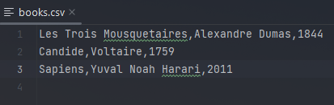
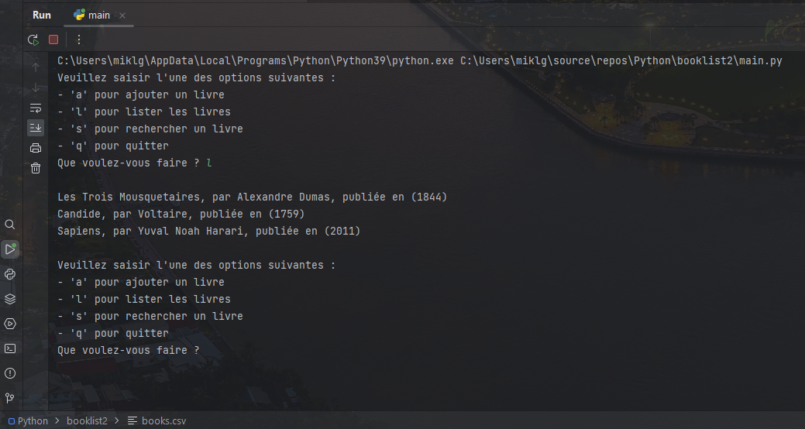
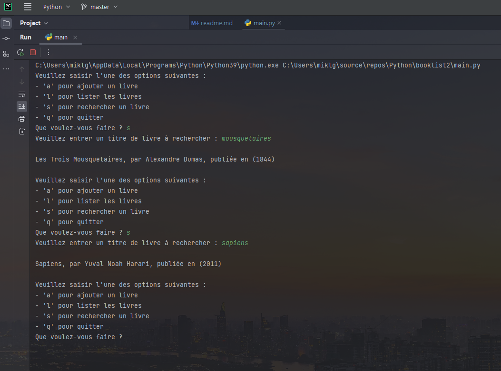

# **Liste de lecture sauvegardée dans un fichier csv** 

1. Les utilisateurs doivent pouvoir ajouter un livre à leur liste de lecture en fournissant un titre de livre, un nom d’auteur et une année de publication.
1. Le programme doit stocker des informations sur tous ces livres dans un fichier appelé books.csv, et ces données doivent être stockées au format CSV.
1. Les utilisateurs doivent pouvoir récupérer les livres de leur liste de lecture, et ces livres doivent être imprimés dans un format convivial.
1. Les utilisateurs doivent être en mesure de rechercher un livre spécifique en fournissant un titre de livre.
1. Les utilisateurs doivent pouvoir sélectionner ces options à partir d’un menu textuel, et ils doivent pouvoir effectuer plusieurs opérations sans redémarrer le programme. Vous pouvez voir un exemple de menu fonctionnel dans le post sur les boucles while (jour 8).

