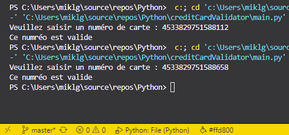

# **Valideur de carte de crédit**  

Ce programme demande un numéro de carte bancaire puis vérifie si elle est valide ou non.

Pour cela le programme :
*  Utilise la formule de Luhn pour tester les numéros de carte de crédit / débit. (Cet algo identifie les numéros potentiels erronés, car il peut déterminer ou non qu'un numéro donné soit celui d'une carte valide).
* 1. Retire le chiffre le plus à droite du numéro de la carte. C'est le chiffre de control. Il est exclu de la plupart des calculs
* 2. Inverse l'ordre des chiffres restants.
* 3. Pour cette séquence de chiffres inverser, garde que les chiffres des indices pairs et les double. Si l'un des résultats est sup. à 9 y soustrait 9.
* 4. Additionner tous les résultats et ajouter le chiffre de control.
* 5. Si le résultat est divisible par 10, le nombre est un numéro de carte valide.

